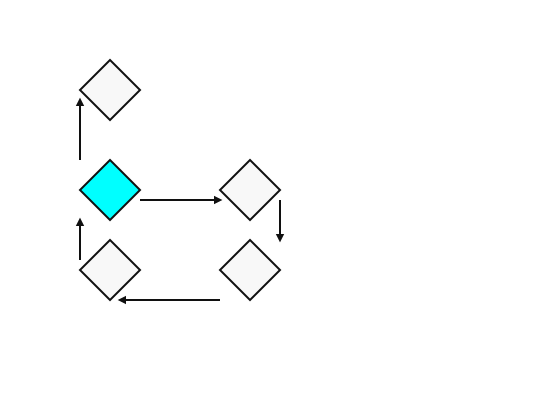

#+title:      current-stuff
#+date:       [2024-11-22 Fri 10:08]
#+filetags:   :highdimensionalcomputing:programming:
#+identifier: 20241122T100843
#+EXPORT_FILE_NAME: current-stuff

#+begin_export html
<h2>Ideas are a kind of animal.</h2>
#+end_export

- Software developer, clojure enthusiast, social activism volunteer,
  now thinking about neurophilosophy from an engineering and biology point of view.
- Looking for the stuff between the mind and the computer.

#+begin_export html
<iframe width="500" height="500" src="https://vehicles.faster-than-light-memes.xyz/art/p/pareidolia/0"></iframe>
<video controls="false" autoplay loop  src="vehicle-2b.mp4"></video>
#+end_export

-----------------------------

/"The Current AI is not as smart as a 4 year old. It's not as smart as a cat for that matter"/.

[[edraw:data=H4sIABKmQGcAA72U3XKDIBCFX4Uh1wZBbWNG7LNYRWWCkAESTZ++SyRNL9qrJh0GkMXD2W/4qdx5QLPs/Mhx8ZJiNAo5jJ7jnMFgmZR2HI/eH/eEzPO8nbOtsQNhaZoSkGJ0FtZJozmmWxoF+0VJffhJRsuyJNdZXFdWtB4tHIPP5dr+mobsOBadbebkvWkPgzUn3WHkvDUHwbE2WmDUS6U43vR9jxGpq+G7yHQX8BNKyaMTUZdEN3ZfaEPTUO5r7ULByEJ6GYTtsvYtjOlr+IAACxEw9GLxKDRJo9vRWI4n2XUqZGa0T/pmkgp0rtEuccLKPk44+QHWdPfleksCfmbXPVj7um18RYLBH0mKSFLcSIpIkpXPJ8lTIDnCkTHaPYSGRRoWaVgeaSh7Is1upaFgVk/m5MQbeggNjTQ00mQ00hT/cMgCzJ3jGVZZvlrBBa+ldnD/3d2QDFDhSak/AbAmzb6TBAAA]]

-----------------------

embodied... ?

- *robots?*, nah - toy worlds
- *software animals* with their own rules ✅
- toy chemistry ✅
- toy game worlds ✅
- toy sub-cognitive modeling ✅
- toy toys ✅

#+begin_export html
</img>
<video controls="false" autoplay loop  src="/2b-plain.mp4"></video>
#+end_export

----------------------------

- go slow, engineer small animals
- *Braitenberg: /'Upward Synthesis'/*
- *bottom up design*: programming philosophy of the MIT lab
- S. Papert, M. Minsky, G. Susmann, H. Abelson
- /There is plenty of room at the bottom/. (R. Feynman).
- Perhaps there is plenty of /animal capability/ at the bottom, building animals shows what the
  requirements are.
- The logic of evolutionary drivers: A function is implemented via structure.
- How do the control centers of the brain relate to the world and each other?

[[edraw:data=H4sIACWzRGcAA71XW2+bMBT+K5b7sknhnqZJFZDWPKwvk6Z26i5vDhzAimNHBkLaX79jwGubrtLUhYpLHGPO933nHB+bZbUvyGErZBXTsq53l57Xtq3bRq7ShRf6vu/hCNoPuTwILjd/GxgsFguve0pJy7O6jOl86lNSAi/KOqbn/pSSPeiKKxnTwA1osswgrwjPYgqZZq1j/mLvlukN6Of9ju8wrVVLSf/0e48ws/+vBxTs2GmoQO/hU7WDtL5hNVcxlUoCwnNor9Qhpk7gE3OF5qREQ/4jpn3jZ9dQmoNEe6ypFSVVrdUGrJWcCxHTs8A3B/LdsbokSPYLWpw4F8bw5IJMJ/4vSrxk6fUMsWH0JUuNrMihQ7nv7q9669EDa5ZuCq0amb1CJs/zDqx4+pLK7pEeCMF3FQzvOQNa+GjIKrG2IEJrCKSRXuAbryDbYI6N1PQYmin2hKaBkDUcamJuDpNpqXRMtzzLhOGmZO3kbMsFvlcxWTkYGJ4PDyr+AMbusUONV2b4YyAwOMlKabS+9AzEf6o5H8QsrJbIaonG0xKEgxj0V3LFKiZIwWQhOHuzphzW03n+XNPMalpYTeGImuZPAvStZIJtm+qkIbLpFtoQRfPx5IRDiAxGsgINa9TQbN8en7k5ekHhICi0gmY2Pn4v6LTW50fRH4n77ATWA1tarHWbuV0Ke0Nh7aunAxLrWqPFh7MXa8JH+s/4fc00tRozmEQz/y6a4hXi5b8TZuiX3fkHcYyEjob5GXQ1RwOK4rKYkFUJbde4bZkQyrRtko9JY2pofMXRXAJhMiNoeq0Zl+QGap42gmkim1QAP0lJfJG24VHajlNDLtywL4qIktyuxnTsdFggzdqCUMQht80O31WapApdhy59rMejEJg/IfCZPQDiSgyNsKBjziOcOcdz9xoL3zU6/i4ccZkwadylM87cpNpxiUt5qnT2HpHup5BWNe4e+R7MTlXAASoCdeqSURnYxdGE2nXdMbG67SZinRusc1LiZhi0TS2S4pYcPyBGrVg2xGYOY4F8Hd0r8MIPo+Q3bYN3J0ANAAA=]]

(colors aesthetics)

[From S. Murray Sherman and R. W. Guillery, Functional Connections of Cortical Areas]

Perhaps by building the other control centers, we will ganglia-thalamo-cortical shaped holes.

----------------------------------

* The Neuronal Ensembles | Neuronal Memes

Recurrent neuronal nets with sheet inhibition make stable, coherently sub-networks.
They are the on top of the neurons, and can be see as the "neuronal letter" of
the "neuronal alphabet" (Yuste).

My idea is that there is a new kind of biology, the structure and function of the neuronal ensembles. They are a kind of animal.

Levin tentatively suggests "Ideas are alive".
We merely have a substance chauvinism.

Braitenberg, Donald Hebb, Rafael Yuste, György Buzsáki, others: *The Neuronal Ensembles*.

#+CAPTION: Blerp fields with different parameters. Cyan has higher attenuation, making the elements move. Blerps are inspired by neuronal ensembles.
file:./blerps.gif

[[denote:20220923T161021][More complete doc]]

---------------------------------------

Hebb: *Cell Assemblies*, /The Organisation of Behaviour/ 1949

- *theoretical psychology*
- Influenced Dan Dennett

focus: /causality structure/

#+CAPTION: A Hebban Cell Assembly (conceptual) is a group of neurons activating each other.

If A goes to B, then B follows A. The cell assemblies together with the proposed local learning rule, /Hebbian Learning/ is called /Hebbian Theory/.
/Neurons that fire together, wire together/ - the slogan is somewhat misleading. It is the neurons that cause each other to fire that wire, it takes 2 timesteps to do that.

*Thought Pump*:

- Activate the /halo/ of the assembly by increasing the /excitability/.
- By /decreasing/ the /excitability/, the assembly would narrow down into one of its centers.
- This depends on a /threshold device/, something that regulates the thresholds (excitability) of all neurons in question
  "area"?, column?, whole cortex?, 'sheet wise', claustrum?, basal ganglia? thalamus?, not figured out.
- It should select the best-connected sub-center (given ideal inhibition, see below).
- This move then, could be done at the speed of 2 neuron timesteps, and it could be a parallel search process.
- Jumping from thought to thought, creating a 'train of thought', hence 'thought pump'.

#+CAPTION: Concept of a Cell Assembly with halo. The halo only only activates if the excitability of the neuronal substrate is high.
file:./halo.svg

[[edraw:data=H4sIAIhLaWYAA71WwY6bMBD9Fct7adUAxmYTsgpI6amH7aWXbnujwYAVgiPbCWy/vmNslHTbSFVbVgk825h5M/NerGz0uUbDoe10hhtjjg9R1Pd92LNQqjqihJAIdmC35WFoRbf/3cZ4vV5H41OMelGaJsP3S4JRw0XdmAwnFCZnrrSQXYbjMMb5puSVRqLMMC9V0Qd2CquHQu25+nk9IEGhlOwxck8/O4blNP/gWWDhqLjm6sy3+sh35lNhhMxwJzsO9IL37+WQ4SAmyF7UfjFSvHrKsBt8GQdSCd5BvOJkJEbaKLnnU5RKtG2G72JiP5DvsTANgmQ/QsRFsLKBFyuULMhXjKJ8E7kMYWDryzcKskLDyPI83m9269KBb8VuXyt56sobyVRVNZLV1y/J8hnS420rjpr79wLPRi+BpkqmWJxBNCBSkF5imzI43ME8tknuBj+I/nd06qMnxEU3fDDI3oKi2zVSZfggyrK1dcvOBFVxEC28p4tOByC6qPwDLb4DdZy+FMt2nFo2X0G+jTeRje+pXuy+zXxFcCuRKypbTr6lE9VoGOeKgHeg10m1b+5+8fpb/MdddV6wHoTfK4oT8kipx+UVUo/EYfqXEoKAaZo6CamXkHoJE68gTedT0HeVOQHfNUUrX6O1jNiWPVqwHRyReoQOM9fxseo500gSx5d4ZZP0CqlH4nBGEZbe2kCRh2H4Ot5GzBboYOkgdQAVO3Sb/v1sYt7YzBubxdPJt5ozOrufTzKWXp98KECaG9Pycs4jcOJkNzhn9Ys3DPWOod4y1HuGkYtXohou+J+T/wDNHmTdDwkAAA==]]

- If the assemblies are 'settled' and "don't move" anymore, perhaps this could be interpreted as the 'best reachable interpretation' for the system.
- This remains to be purely conceptual afaik. But is a cool idea to have in any case.

Since you are scrolling through already, check out this work on visualizing much of the activity in a zebrafish larva:

#+begin_export html
<iframe width="560" height="315" src="https://www.youtube.com/embed/lppAwkek6DI?si=ZTEV4rxxrAcK8A4V" title="YouTube video player" frameborder="0" allow="accelerometer; autoplay; clipboard-write; encrypted-media; gyroscope; picture-in-picture; web-share" referrerpolicy="strict-origin-when-cross-origin" allowfullscreen></iframe>
#+end_export

--------------------------------

[[denote:20240606T185815][Assemblies]]

----------------------------

*Moshes Abeles*: Synfire Chain

[[edraw:data=H4sIAMPTQWcAA71Vy47TMBT9FcuzAalpnLT0MWoiwYou2LCBYedJbhKrqR3ZbtPy9dybxwwD0xEaKHLi2Nf2Ocf3oWzcsWSnfa1dwivvm9swbNt22s6mxpZhLIQIcQfvt9yeaqV3z22M1ut12K1y1qrcVwl/txCcVaDKyid8HuPkCNYpoxMeTSOebnIoHFN5wiG3sg1oita9tDuwT+2BCKS1puWsX/3SMyzG+ceBBQ2NBQf2CO9dA5n/LL0yCddGA9IraD+YU8KDSDB6Y3o4s1B8TXg/uOsGxirQiCcP3nDmvDU7GFEKVdcJv4kENdTbSF8xFPsJESfBkoAnSzafiG+chekm7BXigO6XbiyqYqeO5dz1F7316IF7me1Kaw46vyCmKIqOrPz5kMnPKA/qWjUOhnPBwBY/Ao03ecBaUUNnoLxIkFdQ7Qy/GRlWNEDDWnSEV0KPo9fCL1Zr8kUP36NHI/rsb7W/BL4cwKNBepcWfewD0BiVg63f3PyW0W/5H/P3EadMQ8exaC6q+MnzLwJywWOvj8dL6A8uGwLi4eQZdYHUWWVswvcqz2tKc6N9UMi9qvGck9oFWOOqGBac+g6UPL/WJhUYZRRRoHvSrWburLNNSBzXoZvNBz6s5lRmXh2lB+YrYJrYqIibq/KLnn9F9BYk27L/QYe/iZFvO/KFJb7460h/AJ9JDSxiBgAA]]

[[edraw:data=H4sIANDWQWcAA72VzY6bMBSFX8XybFopBOPQDBkFpHaVTTddTH92Lhiw4tjIdgLTp++1gWZmOpG6aCIC+Bpzz/2OjbO1pwYNB6lsjlvnuoc47vt+2a+W2jQxJYTEMAKPQx4GKdT+rYHJZrOJw1OMelG5Nscf1gSjloumdTlOKQQnbqzQKsfJMsHFtuK1RaLKMa8M6yMfQu+BmT03L/sjEjFjdI/R+PTrqLCe492kAh2d4ZabE/9oO166L8wJnWOlFQd5wftPeshxlBDkT+p/GBlef8vx2PgeGtoIriAfOzqNkXVG7/mcpRZS5vguIf6AejvmWgTFfoaMi+jeJ17co3RBfmAUF9t4rBAanq/YGqgKDUHlKVwvunV24Ccr943RR1VdKKau6yDWPH9JV09QHpdSdJZP70WTGj0nmkn+5Mr8AWZAecGdYbyXEPsaS4gTQoJeYB8BI65A+mjku7u/pu09/mf5EcvbCRooI4/+ltBR7r+yJOmNYZI10GR+yV2BhtJb0vgPh5IdWOip0ET1SEloX2Gu5oVHb0AXKFKYK6AcFyFaA2s2sabn9ej44F7tB8j3RUyVrTY5Poiqkv4z1cpFVvwC2SSbwpodhAQ2y5SNYMsSddgRqPfPzyPcC/ukamE4Klsm1AIxJLXuYMcA+BRxyQ+wS9lt7DWv6wlArzKyAx+yZ+iXWd+Ce23CS99g8GpGB3sLVjpxYo7PdHEDJ/wTFb8BPp8EdrEGAAA=]]

[[edraw:data=H4sIAG8gQmcAA71UzY6bMBB+FcsrVa0UB0wiQraAlJxy6aWH7bY3Nxiw4tjUdgLbp+/YkGa37Uo9NBUYxmMz389Y5PbcoOEolS1w61x3H0V938/7xVybJkriOI5gBx633A9SqMOfNtL1eh2FVYx6Ubm2wMtlhlHLRdO6Ai8WKUZnbqzQqsB0TnGZV7y2SFQF5pVhPfFTyB6ZOXDzMk9iwozRPUbj6qcRIb3MdxMKJDrDLTdnvrEd37uPzAldYKUVB3jB+60eCkxojPxI/I2R4fVjgcfgcwi0EVxBPXZyGiPrjD7wS5VaSFngOxr7C/h2zLUIyH6AijOy8oVnK7ScxV8wiso8GhlC4PWVuQFWaAgoT+H5qltXB76y/aEx+qSqV8jUdR3Amucf6eoJ6HEpRWf59B2Z0JJroYuSn7Uyf4EZQC+4M4zvPcxpCCBB0zgABvGjQsIVYJ+MfHv3W9/e4b/GH3V5PwED0WX8EN7ZiPdP1cDhfqnG8cH90l/kc4SpfatNgY+iqqS3XStHrPgOgDSbpjU7CglVLVOWwBEUdegwTVZz4DehlJs88hVv7FwGjiXxDgSixB9y7yLEGaTCmQ+GIiDk0zdvZJIGzB3QQM/wb2Z56KvvM2CU2/9ieBqUPQSFPr6hukUyqQOV5ZtvJ+3eb1DLuo4rkIUYDMkc/EG31+y47eJE1MCAn3r5A39YDSL8BQAA]]

And so forth.

Perhaps the details don't matter.

------------------------------

Reverberating across brain areas for *multisensory integration*

[[edraw:data=H4sIAHXcQWcAA71WXW+bMBT9K5YrTZtUiu3QhHQBKdtLXvqyh+zjzQkGrBCc2U5I9ut3DSZtt3aathKBwTZwzuH63AszcyjQcVvVJsGltbu7MGya5qYZ3ShdhIwQEsIduLvl7ljJevPcjXQ6nYbtVYwamdkywbdjglEpZFHaBEcMBgehjVR1gukNxeksE7lBMkuwyDRvAjeE2S3XG6Gfzgck4FqrBqPu6ueOYdyPF54FJnZaGKEPYm52Ym0/cStVgmtVC6CXovmgjgkOKEGuMbdjpEX+JcFd52vbUVqKGvD43iqMjNVqI3qUXFZVgq8ocRvo3XFbIhB7D4jXwcQBX09QdE2+YRSms7BTCB33fulMgyp0bFlO7fHFaD1EYMXXm0KrfZ29ICbP85asePyQyk4gT1SV3Bnhnws8G3sA6t/kjBW7DYIB8iIXFBAbw3l98mcYMyc2/E/wkQefeHA67dFvXwG9lx716GOPHpF/RR/HUxdnh049On097X9Cv+210wHQz9I9uBVHi9wh4PW6VDrBW5lllXObqm2Q862s4DHDaxNAqsncXzDyBzDT+NcUcT5nLujHbhXS+Sx08MMwxY+I7ockag3l1sQxLS/wShFYOV1pLmvEteCmp3xVM4yod8OkM0Nb3boSFogaisteV2+vfivM7/Bf03eFyxVMFhFEY7JgjCwhmksaQWPDmXDkVyx21kABevN9r+z7rbJKd90hF7End5mQzs/sfJ9J4D9dTsCIOb+eBRyk2fPqKf2giz52H11Ssmf2JbhhScfDOw++Aci7bUkJWYzAhRCfxSiCBnNuCNPMmROmWXQhSYwc2AXyLm6XYMEuEGnIbZfj5ZBpzXxmufqoBfxkroSG/766QB+hNqK5MWK7qqQ4V8ywgAZ/telPk3801v0KAAA=]]

[[[https://youtu.be/X9roMB8nCbo?si=huGx2Frlz5IFxUz0][Pulvermueller: Semantic grounding of concepts and meaning in brain-constrained neural networks]]]
[[[https://pmc.ncbi.nlm.nih.gov/articles/PMC2258460/][A neuroanatomically grounded Hebbian-learning model of attention–language interactions in the human brain]]]

-----------------------------

** The Thalamus

[[edraw:data=H4sIAJEFQmcAA71XW2+bMBT+K577skkl2IakpApI28PEpE6V9tBd3lwwiRWCI2NCul+/YwzNkq1a24koNpjb+c75zs1Z1Lsl2m/Kqo7xypjtte+3bTtpg4nSS58RQnx4A7tXrvelrNZ/e5HO53O/e4pRK3OzivHsimG0EnK5MnAREIx2QtdSVTGmE4qTRS6KGsk8xiLXvPXsJdzdcL0W+vi+RzyutWoxck+/9gjDdTqgYLTVohZ6J97XW5GZL9xIFeNKVQLgpWg/qH2MPUqQncwOjLQovsXYLb53C6WlqEAeb4zCqDZarcUgpZBlGeMLSuwP9N1ys0Kg7GeQeOldWcGXVyi8JD8w8pOF7zSEhbUvWWjQCu07lIfu+CRbBwbuebZeatVU+RPKFEXRgS1//0jlD7jHcx95PRQ7SBnMGASJAETlB0UoOWhImdO5O4MFEekwRVnKbS1ejqFBlrVT7905g2s2twu4MXfCO3Idg56owLZGl28v/oiLd/jZ8I436y/wfkBIGpJ0RtJofDzgErGI3LEZzBAmg0nIHX0tkYW4D6PiH0QGgZP+sjgYRD8nDkIyPnfBzDkriAgCPBRa7mANXCLgErEulQkCLtMwHF+fqcOy/nPYgy69L43YG2QPHq+yldIx3sg8L23Gqsp4Bd/IEiiseVV7UK5k0T+o5U+ApdFpmUGdix3fgI2TyWSy8C3AOFi0x6LAZZIpDeIR14KjT+dADWenqI+woyZo1AXRjh2N1fEYvyy5unSixcl4ZcGYRfPiiYIxDfqCwYLxQnjal4zAhtVGGaWR4XopTD1mWNlwekQt+QPsLqaoEo1W1SW61xZI1G/G1GA6aGADu2628BmYnilwYNaUTY2EyUbNZ2t637OTj7fnQArA1Ul6e4687Qp/eEjRO3qGNIUOZEFh+9B1pRRcexZc22UobFig66VQKlJ2pu4LmMc1cJQGEPXBQ/oGIDPluTMvh1D6r7JH+7JH+7JHh30SnY9nFutzgtmcuJki1ZhtY0btpH3BsR01uQkHKH8JE/7OJb8AbKEOg/YNAAA=]]

- Messages and modulators are 2 different kind of things, messages /drive activity/
- The thalamus is /the driving input/ to all cortical areas
- Cortex cannot be understood without understanding cortex and thalamus (my conclusion)

- Consequently, the only way for a lower cortical area to /drive/ activation in a higher area,
  is by outputing some kind of motor data! I find this quite remarkable.

- SDM Address Decoder?

- awesome talk:

[[https://www.youtube.com/live/aB2M1gg_1sU?si=BbYl3kPBO-Py1aE7][Thalamocortical System I]]

-------------------------------

- maybe memes are /bags of counterfactual expectations/

- memes know themselves how to be /used/

[[edraw:data=H4sIANC9aWYAA71Wy3KbMBT9FY0y02lnTHjaJqmhk3bTRbPppo+dagRoDBKVZOP063v1YEjSZKZZEGM46OFzzr1cCe/UqUHnvuOqwK3Ww3UYjuN4OaaXQjZhEkVRCDOwm3J97hg/PDUxvrq6Cu0oRiOrdFvg9SbCqKWsaXWBswQaJyoVE7zA8WWMy11Fa4VYVWBaSTIGpgm9PZEHKh/2B1FApBQjRm70m1PYTO3PXgU6BkkVlSd6owa611+JZqLAXHAK8oyOH8W5wEEcIXMm5ouRpPX3ArubH/ZGSEY58JGjFhgpLcWBTiw167oCX8SROcDvQHSLwOwtMK6CrSFebVG2in5iFJa70DmEGxNfuZPgCp2typ29PputOQO/yP7QSHHk1TNm6rq2Ys39H4nqDns996PASyUzyxTGTJTDZzaymQ1CKVjLGQD4j81Q+FJ+moLV6kn++CF/4vltel0OA8ohuqPs3l78Uxnv8H+bcJkzTyxNolUefTEA6g4Tj5nHDWBm0drR9KyRuQSE71shC9yzqurMoxBcBzXpWQdBKMJVAHXIaj+g2B9wEueP68dEHOcu5BQ0SkW5EhJVRJNdaISWTQE8VZMCAyYFFhOPmceNR5gH58raXSgVtshMdcECKOkdRYNQDJYwn3KxiGh2T5TUtZAVkNNXST9sQanLs0XIrcPNPUw8Rg6T3KMvSdp1bFD0BYs8Nwdsd6b2zLYHsa8B99BOTcferL/tEuzpouzrR+xLFEuaz/tT+eb3Uej3n0TfM93DG+OD61iyWDO/QkzRev0brUEbFskryCfTXjXLN+zEOLx5uBZItxQU+8G8djmCjk6Iw/Ku7O48rWAn14rxaf2wgRP+0pR/AVvAAnD6CAAA]]

Up to pre-frontal areas, perhaps...

[[edraw:data=H4sIAKDJaWYAA7VWXW/bNhT9KwT7kA6wJH6LCiwDnV9aYHvpS9u8KRZlC5ZFg1IiZ79+lyIdO10CrBtiW7ofJM8594oivBwet+h06PqhxLtxPN5m2TRN6cRT67YZI4RkMAOHKbenru33r02kRVFk8yhGU1uPuxJLRTDamXa7G0vMicbo0bihtX2JaUrxalmbZkBtXWJTu2pKfAjZQ+X2xr3MJySpnLMTRmH0W2BQ5/hzZIHE0ZnBuEfzaTiazfi1Gltb4t72BuhbM/1uTyVOKEH+Yv6HkTPN9xIH58fsWNeaHvCqh9FiNIzO7s0ZpWm7rsQfKPFf0Husxh0CsX8C4iLJPfAiR2JB7jDKVsssKATH17daOlCFTjPL03x/s1uXDtxXm/3W2Ye+fkNM0zQz2fZ6ka2fcOQLi5JIxS4o5zKegbT/XoSoK4EsSGYUe/0+yn4ZvtHweRVevYY+mtP4U8ORzyVVv9lZV+JDW9ed74Ptx2Ro/wJOqmPYVIe2A8ih6ocE9kTbzAwqMFCgWKVpusw8YHyM4VklpocuPrju44d/7MDf8L+uNjwhvzMEQYr8AXc93ykJhgUjglFXJb9d42tF/Vz8y375phISatZQ8xe0qXp0b9DNznQ1ans0Wbdv+y06mIN1TzfnjryLEkEu3X9WcnS2h929MfW7cuvIra65D/CiV133hPrqsd1Wo6nRaF9sil9+efwj51KncsGISOWaSwWeTCXiks5ZFj04Nddnz4+K2fOjRfDWXMlzThVgVVrkknOWi5zDfDqnAXAdrPYkSiwYFTOd8nR0FiHys4+4CDJUKrgQsJKpPBf8OU/WwaMFgRzQapZynXtZ3l/znIClHikHoYwWuaJKCBDl16RCUVEUQvJC6VwgrokH9SI0mUWA7Bx6QtUsF4QzAJu3/3/vOJPAwuU6WDjZBTAxCZZ4u4axEPM4zuN8Jr1FjEEML2KwPg9W+hjGZVwnI46PRbQy5mWMVVynIo6KuDLyBJ13/7Nc7uXBecIJS1VeeG4IeJ7CwBxcEbzTsabCGabCGaYuZ9h7kupAqgOpvpBmW7jgr8rqbzfLAw3SCAAA]]

** Not only circuits, electric fields

- (Peter Godfrey-Smith /Metazoa/ for a chapter, György Buzsáki /Rhythms of the Brain/ for a book).
- [[https://en.wikipedia.org/wiki/Ephaptic_coupling][Ephaptic coupling]], has a cool history

** Synchrony

- This is old: *Wolf Singer*:

Gray, Charles M.; König, Peter; Engel, Andreas K.; Singer, Wolf (1989). "Oscillatory responses in cat visual cortex exhibit inter-columnar synchronization which reflects global stimulus properties". Nature. 338 (6213). Springer Science and Business Media LLC: 334–337.

- Earl Miller: /Cognition is Rhythm/, /neurons that humm together, wire together/.

- Has been proposed as a /bind/ operator for long.

** *Rhythms* / *Neuronal Syntax*

Seminal, as far as I am concerned: *[[https://pubmed.ncbi.nlm.nih.gov/21040841/][Neural syntax: cell assemblies, synapsembles, and readers György Buzsáki]]*

Buzsáki cleans up the Cell Assembly concept with the /reader centric cell assembly/.

At the same time he puts into the center what was obvious and causing a certain amount of confusion so far:

Synchronous (correlated) activity only has an effect, if it has an effect. For instance a reader neuron listening for sync activation.

- [[https://buzsakilab.com/wp/][György Buzsáki]], *Neuronal syntax*
- Ensembles are like notes
- ~7 ensembles are a putative neuronal letter
- Rhythms are widely preserved across brain sizes
- Bonus: Octopi have a similar EEG to humans with more γ [Peter Godfrey-Smith, Metazoa]

[[https://pmc.ncbi.nlm.nih.gov/articles/PMC3553572/][Brain rhythms and neural syntax: implications for efficient coding of cognitive content and neuropsychiatric disease.]]

#+begin_quote
Multiple γ cycles, each containing their own cell assembly, can be thought of as being “neural letters” and these letters can then be combined to create “words” and later “sentences.” More precisely: discrete episodes or packets of γ oscillations, which are typically shortlasting,5,15,45,58,59 are often grouped by slower oscillations via cross-frequency phase coupling (Figure 2).12,14,15,60-62 This packeting can be thought to associate the “letters” contained in the series γ cycles to form a neural “word.” An example would be a γ “burst” which might be cross-frequency coupled to 0 and therefore present in a single θ cycle.63-66 Then slower rhythms In which θ waves nest can bind such words into “neural sentences,” ie, longer messages of information, coordinated across large brain territories.
#+end_quote

- *Peter Pesic* /Polyphonic Minds, Music of the Hemispheres/: Understanding brain function /in terms of/ music.
- I.e. consoncance, dissonance, multi-voicednes (~ parallelism), 'tonal fabric' | stuff like that not as mere analogy

--------------------------------

#+begin_export html

#+end_export

---------------------

*Nereunal interpreter*

If there is a *code*, there is an *interpreter* / *interpreters*.

Genome computation:

- letter: Base pair
- word: codon tripplet
- interperter: ribosome

Neuronal computation:

- letter: γ oscillations packets, *discrete* ensemble
- word: A series of γ cycles, for instance ~7 in one θ cycle
- sentence / composite: speculative, longer time intervals?   👈
- interpreter: ???                                            👈

* Neurophilosophy Stuff | Neuronal Memetics, Wizards Of Activation

- The dragons of old turned out to be dinosaurs
- So the spirits of old turn out to be /the software that animates the world/.
  (Josha Bach, Valentino Braitenberg).

----------------------------------------

What is brain software?

An operating system of a biological computer that makes a *magical interface* to it's /user/ (also /person/).

*The Magical Interface*

- Is *the* benchmark for a good interface. As in: "This tool is like an extension of my mind".

Perhaps It allows an ad-hoc crafting and debugging of pieces of technology until something
that sticks is found that serves some purpose until a replacement is found.

Sevant-syndrome indicates that the capacity of this technology is seemingly infinite,
the bottle-neck being how much time and effort the person is engaging with the activity in question.

- The developing brain has 4 years + some months to make a 4 year old
- The brain performs a *software synthesis task*, this must incorporate substantial *design*

-----------------------

The synaptic overproduction and subsequent pruning seems at first glance a general fit for /evolutionary variation and selection/.

*Synaptic pruning*:

- at least 50% of synapses disappear
- neurons that act jointly appear to maintain synapses between them
- 'the brian is sculped by activity'

*critical periods*:

WIESEL TN, HUBEL DH. SINGLE-CELL RESPONSES IN STRIATE CORTEX OF KITTENS DEPRIVED OF VISION IN ONE EYE. J Neurophysiol. 1963

------------------

** The Magical Interface

- Dan Dennett acknowledged the user interface nature of the mind, and made an anology to virtual machines.
- Dennett's analysis stopped at a 'hiding of the details', this is where we can improve upon.

[[edraw:data=H4sIADfNQGcAA72UW2vbMBTHv4o4he4lji/JQtJGhtEx+tK9FPau2bJ9iC5BkuN4n36SHTcZdG91EdYx6Bz9/ueC9vZUk7MUylJonDs+xHHXdctutdSmjrMkSWLvAaPLw1mgOrznmO52u3g4BdJh6RoKmyQB0nCsG0dh/XUN5MSNRa0opMsU8r3hhSNnCt6tH/b/BmJJgZeGddFvVhxqo1tVArHO6AOnoLTiQCoUgsJdVVVA4nxf3wbpsp94Y1B0QWXXW+7SJKzrRduwrkI2V4FZMkpOM299Atk2GZgfDhjsrIDtvwDHz46ELWKqaLShILEsRSivVi6qmEThwyxTNrLcYHU5sPjHC0i3b+xJSqjSZmSsvM0LLY+tY86PARP7OKDmoWbrC9XbnIlaG3SNxGJO5iq7yRTlUXDJ1ZjsnNhLD9e+p/kLM+aLJSsi+IkLS3RFmK90b9HOKWHqcbD5a28dl/aeyePjj1YVY7PR9Z/R70HBr9dvC/L8/WlBfvLWBLr/cbNWILutgJ8zows0RYvOLohpej97s+Kn0UvDuDfMlB0zfALGtf/8K57/BSPfRrrtBQAA]]

A main idea of *computer science* is that each layer can be implemented by /any layer below/,
becase of *turing universality*.

But... if this is *software*

[[edraw:data=H4sIANDeQWcAA8WXW2+cOBSA/4rlSs2uNATwkAnpDqy6u6qmD81DI023ffOCAStgI9sMM/vr99hAZ5I2q1QKU3EzBs53bhwOa70r0b6phU5wZUz7xvf7vr/sl5dSlT4JgsCHO/Bwy5t9zcX9924Mb25ufHcVo57npkpwfB1iVDFeVibB19ENRjumNJciweFliNN1zgqNeJ5glivae/YUZhuq7pl6OO8FHlVK9hgNVz8NhNV0vhkpMNEqppnasbe6ZZn5SA2XCRZSMMBz1v8h9wn2wgDZjdgVI8WKvxM8DD67gVScCZBHOyMx0kbJezZJKXhdJ/hVGNgF9G2pqRAo+wEkLrxrK3hxjaJF8AUjP137g4YwsPalawVaob2jHNz+SW8dPfAPze5LJTuRP6FMURQOVp4+JPMDHnnDQ96IIkcpkxlfBcV2OSqyOioIqeBUvrJzYACJA8d8ccAqeggwbG+Q3XlUZJVUCW54ntfWeimMV9CG1/CYpkJ7EHpejBc0/xcUCOPHIXNGkIGxBH6ayabtjM0UQeu1b1HzUFfBSAULU1qXkGamang2KzM+sZQ3bc0aSG1n7JzYycGhxd4dtGGNfk2b9rd3ncgGT3NzOIeznQbbu7cLtPnrzwW6ZZ2ydBgYPSv/1AMQZCUzrrKOG71AqjpA4OfFj3EPba5VVOU9VWwCupo1FCaPCSgZnap/efVNuf0VP/vFHsqRLYPLOEDRKthG0fD6zskC36IoBpY9RrCRl6hJ5FiTbPCsN5ejN+Pz2AQv6xaKBFrOZQ85rz0E7CFnygdCgBUMLFbXvNXsx12nDoPb1H44ZofRd5l9pWaVPvnpZaWTSffVGaIAfRVwNlB67HEbninyjhnbns5lAQJPbsMZm4ho+pwDI72oqSg7WrILVNMDNLDv56zuZPV/6Ns50WF0gm6VLBVtbHy6zHTn+cJcBS7GG6j8G6j6tedivoGatoGQbwiZL+RkDLltLtKGljyDTqLT9n9FGKYKmrHfZ22rxrptm/AU/M1FiTrB7Y/VsXWdveV3lj1S7mlDT+x5yu7n9sYzMZ/dIr40/+e2iEtykkw7rkwHNjc0q7hgs4LD0e9XNtYXGqQalMmc6YtzlA8Su6ZxR8a1gjUKqpUbTOv2ym4BtJZjzvslbHpXpv8B4lzcYTERAAA=]]

But with ~ 200 brain structures, the brain might wear it's computational layer on it's sleave so to say.

Not the software layer, that would be implemented in terms of information transformations.

The flip side of turing universality is that *programming languages* are not powerful because they allow something new to say.
It is *how* they allow to say it. It is a concern of *elegance* and *design*.

The competence of a software framework, language, operating system is in /what it makes it easy/ to say. 👈

----------------------------------

- Software engineering so far did not have much influence on neuroscience.

- Part of the reason for this is that the philosophy of programming is a niche topic
- For instance the property of Lisp to have a runtime interface to the language is not widely appreciate, yet it is a fundamental step in the power of a language

----------------------------------

* Neuronal Memetics

- genotypes, phenotypes?
- [[denote:20241116T184716][meme engine wizards]]

* Notes On A Constructor Theory of Adaptation

[[denote:20220923T161021][link]]

[[edraw:data=H4sIAHvUPGcAA72WTY+bMBCG/4rlvbRSCJ+bwCogtadceumh7fbmDQNYARvZTsj213eMYbPbdqWuVCoC/p5nZvzayk6fa3LpWqFz2hjT3/n+MAzrIV5LVftREAQ+zqBuyt2l5eL4p4lhlmX+OErJwEvT5DRNAkoa4HVjcppE2DiD0lyKnIbrkBa7EipNeJlTKBUbPNvE3o6pI6iX/V7gMaXkQIkb/eoIm7m9nyjY0SvQoM7wQfdwMJ+Z4TKnQgpAPIfho7zk1AsDYt/I/ihRUH3LqavcjxWpOAi0x05GUqKNkkeYrVS8bXN6Ewb2QX97ZhqCzn5Ciytvaw2vtiRZBd8p8Yud7zzEio2v2Cn0ilxGyuP4fTVb1ww8sMOxVvIkylecqapqhNXPF8nykU48t8ibUNHVyhzGk6FNmllbsyNhdPUwcS6HAZYYwCYYkW+0n9rnWaD/3XzywryBiyH24zFxaKTKacfLsrWZlcJ4Fet4i6s0E9pDWfFqGtD8B+LD9Fc5WES0cQiLKriopOqsCgXpoOSnjux8C1yGHU/Zs1ksahCygyVxozwQF9lQD+ykQc+48Vg47XsgUJUn1b67+e1Ev6d/vbtO8fakIZZgdvf4knATEIyaxNgXYzuedhbalvca3q4dNaYRy4srDzbOzFZsR7agblKXTHv4C1ay3oyymRP6bwMKp4CSeIF0RU/Wt876kmJIcPNREPs4Db5MglieuXHM5MokYbqcNOZb6xYZhX7UBjq81zA+fXrweqaMXvSUT8K8dReaAcUOVpmLQuMp5MTeZCDOXMlOQGdmpl/ji/9Mip/H03sdwQgAAA==]]

(Colors merely aesthetic).

*Gene*: A piece of /information/ that *replicates* and is *instantiated* in the *genome* as "genome snippet"
(the second meaning of the word *gene*).

*Knowledge*: A /replicator/ which /causes/ itself to be /stable/ in an enviroment, also called it's *niche*. I.e given a niche it is a replicator.

*Adaptation*: The /effects/ that a *knowledge* has, given a niche, that /causes/ it to be a replicator.

Adaptation is allowed to become /intricate/, with many /sub-parts/ contributing to a /system of effects/.
I would say /the means of survival and replication/ - called the *extended phenotype* (Dawkins 2016).

This typically involves an *organism*, /instantiated/ via *development* (Ontogenesis) in biology, but it is not limited to the borders of an animals skin.

Indeed it is not limited to biological substrate at all, as in technology like beaver dams and even more insubstantially, in animal behaviour.
And /propensities for learning/ (Baldwin), /psychological developmental plans/ (A. Sloman), etc.

The phenotype is /extended/, actually this is another thing sayable with constructor theory.
All /possible/ effects that /genes/ *can* have are allowed to be phenotypes.

*Adaptationism*: The bio philosophical position that holds that /design/ in biological systems is /created/ by /natural selection/.

*Natural selection*: /a approximate construction, whose substrates are populations of replicators and whose (highly approximate) constructor is the environment/.
Marletto /[[https://arxiv.org/abs/1407.0681][Constructor Theory of Life]]/.

Is a mechanism that is sufficient for /creating design/, i.e. /adaptations/.

And is the *only known mechanism for creating design in biology*.

Natural selection needs a population of /variants/ of replicators, from which the ones with highest /fitness/ (inclusive genetic fitness in biology) are selected.
I.e. the ones with best /design/, the best /effects that caused them to replicate/.

For this reason, any *adaptation* can only be an adaptation (i.e. display design), if it /caused/ by a replicator for which the /variants/ are /possible/. 👈

----------------------------------------------------

An *attribute* is a set of states of system.

*Adaptation*, the sense of design has to be caused by a /replicator/.
/Information with causal power/ (C. Marletto, S. Walker).

In constructor theory of information - the *permutations* have to be possible.

Something like that:

For all attributes of an adaptation =a=, there exist permutations of the /information variable/ Σ,
that /causes/ the /variants/ of =a=.

Not sure what the variants are, has to do with the kind of universality the system achieves?

The /interpreter/ of the /genomic code/ (Ribosomes in the case of genes) have to have 'a certain universality'.

-----------

If a /natural selection/ theory of /brain software design/ is true, there should be a 'genome-like' /information medium/.

1. The /information variable/ Σ, is a set of attribues where the task of
   peforming the /permutation/ over Σ and the /replication task/ over Σ are possible.

2. The attributes of an information variable are called /information attributes/.

3. An /information medium/ is a substrate whose attributes constitute an information variable.

(C. Marletto 2014, ct-life):

??

4. Do the /information attributes/ of the genome-like neuronal meme medium correspond to the /neuronal code/?

Everything the /neuronal interpreter/ can do, the /neuronal memes/ need to be able to say.

-------------------------

Here I'm drawing what I think Dawkins has in mind:

[[edraw:data=H4sIANTmPGcAA7VWS4+bMBD+KyPvIa0UFsOSbLYKkdrTXnrpYfu4OWEAN2Aj2yzZ/vqOeWzSp1atEARsA/N98/jG2drHAk51pWzKSueaN2HYdd11d3OtTRHGnPOQ3mDDK29OlVTH370Y3d3dhf1TBp3MXJmyTcIZlCiL0qUsiWnyiMZKrVIWXUdst80wtyCzlGFmRBf4Ka3WwhzR/Lge8EAYozsGw9OPA8J6mt+PKLTQGLRoHvGtbfDgPggndcqUVkjwErt3+pSyIOLgf7E/GRjMP6VsGHzuB9pIVGRPtE4zsM7oI05WcllVKbuKuD+IbyNcCUT2PVlcBrfe8PIWkiX/wiDcbcOBIQ28f7utIVZw6lGe+usfo3WOwF4cjoXRrcr+QCbP8x6suPxIZ09sxBs+Ckao+GxlcuMZOYrPlJKBY8TpTow3vMd4ocGJ2cYfF579aj6Z1/zmB/MOTw78JRDqUGqTslpmWeVDqZULclHLir6yQtmA6kjm4wMrv6E39nP+PUQ8QvjY7aTKtal92SmoMZNtDdvQA86DfRM/u7crUOkaJzSsKtlYfHks8YbKiCrMeLNeDafhfvAu9gNaWN3OGMexEtZrcqYRUpEgD9g4bSaf/q841ufi6Mv8orZ7wYWjmAfFBqhIS62pXl390odesxezGHTq+8NqTe0m5verhMMq5g/UW4GqEyJa70UwNz61u8jjc/5AePfJhu40T9bjPJkvtVF8kdpHUbUIX9uswJraLNh2HzTCuDl1sh7xKd87skyxxQyakhTjnhpcUscvhJK2BqEy2BtffJ00UhWzindktfKN45VPsgJhYa9PsG8dZBqtWjhQSFydhj1CpQ+iIovZkprLoRwot+qoO/V6TqZTF11tJmlaWShR/ZswxT5Hsfpr1/6vPQf3ySZ/ifl4vopPLvYEasxoYUEbwwL64ElKssjmTNi0JQ16M7LfkOwSDqK1VNVgKx+b6gkqtESN2CwmOnP2oLHXlTEvk4szHs/Z+0/s4+FjgLC4yMTiJ7HPGoJNvw2Qt/c3fMbNdCrxZPLYTt6FBf3oT/3uO41fz/v8CwAA]]

* The Activity On Top of the Neurons are Animals | A new Biology

* Hyperdimensional Computing | Sparse Distributed Memory | Associative Models

#+begin_quote
It should also be noted that the message system used in the nervous system, [...] is of an essentially statistical character.
In other words, what matters are not the precise positions of definite markers and digits, but the statistical
characteristics of their occurrence, i.e. frequencies of periodic or nearly periodic pulse-trains, etc.
Thus the nervous system appears to be using a radically different system of notation from the ones we are familiar with in ordinary arithmetic and mathematics:
instead of the precise systems of markers where the position - and presence or absence - of every marker counts decisively in determining the meaning
of the message, we have here a system of notations in which the meaning is conveyed by the statistical properties of the message. [...]
This leads to a lower level of arithmetical precision but to a higher level of logical reliability: a deterioration in arithmetics has been traded for an improvement in logic.
#+end_quote

#+begin_export html
</img>
#+end_export

[[https://www.google.com/search?q=von%20neuman%20the%20computer%20and%20the%20brain][John von Neuman - The computer and the Brain]]

#+begin_export html

#+end_export

[[https://mitpress.mit.edu/9780262514699/sparse-distributed-memory/][Pentti Kanerva - Sparse Distributed Memory]]

*hyperdimensional computing*:

- =H=, the hyperspace is vast.
- 'The blessing of dimensionality'
- All hypervectors are roughly same distance apart.
- There is a tiny region in =H= where *inputs* /similar/ to the *address* lie.
- Encountering inputs that are /similar/ to the address is astronomically to be random.
- 'programming with embeddings', can model semantic spaces, *'concept particles'*
- *and* structure via *VSA* operations: Datastructures, trees, sequences, FSA, etc.
- programming in superposition (in the classical domain)

*The address decoder neuron*:

[[edraw:data=H4sIAEmiQGcAA72Xz5ObIBTH/xWGvbQzMSKbuu5OdKY95dBeeumPm11RmRjJAInZHvq394GYmHUz00NxlKCo7/O+8HiQtTpW6LRrWpXiWuv9Uxh2Xbfs7pdCViElhITwBu5feTo1vN2+9WL0+PgY2qcYdbzQdYo/xASjmvGq1ileUbg5Mqm4aFMcLSOcrQtWKsSLFLNC5l1gbqF1l8stk9ftAQlyKUWHUf/0W0+Ih/uNo0DDXjLF5JF9VHv2rL/mmosUt6JlgOes+yROKQ4igkyh5sRIsvJ7ivuLH/ZCSM5asJcftMBIaSm2bLBS8qZJ8V1EzAH+7nNdI3D2C1hcBA/G8OIBrRbkJ0Zhtg57D+HC6MvWErxCJ0t5sb83e+vSA7/y520lxaEtbjhTlqWFVeOPRPGCHa//KHAoerEyyDgbSsxxcSQeOUh6l1dQgf/GQyBqdtKvugSZtiBvn2shU7zjRdEYT0WrA8V/AzRK3G2Z73gDJlXeqgBGjZeWkPSECOosWofGnAPdtvyWqdfIay8vIFCUkSuOH0HJmPPfxyWKpwPjp7/iybh4CgAyUwBE0GfZcrn0iaLkVrB5AsVzgfwPE3WhvTIzqLNTQPnkmXg483i7P1xwNtv3KT1gLSTbg2ze3U0Wqvf4n+d2n8jNAgIdiWAWf7b1ytXU1cTftKbJkDlArjrsZtGaOK2J05o4rclFq08+aF4Yvq2pq2fgGn3U6aROtw1v/3otlzouHXE9ZlbqfQ0fslDiPd0NkkwGT9G9zwXwnFqp763JmeR9E3QmTRcmX6Rp8Hki2cw5iyY6jQhPE8rGue9N0bADNzHxJ0V5UcDfN+WzI+/jUUdGiJclUgjms66Zzr2Ck/EIIgFA2XHF5tpZAPdoz3o4j6NzngUoJhtbVlAoFEI2MEk3kBImvoQVFHWssr+W7ZN3oRAAAA==]]

#+begin_quote
Hearing the voice of a person, say 'Bob', always sounds like the same voice, even though the particulars of the sensor data must be quite variable.

In Hofstadter's terms, we make an analogy between the instances of hearing Bob's voice. We understand/categorize/make the analogy / analyze the situation / find the essence of the 'hearing Bob's voice situation'.

Whatever represents such an internal situation is quite robust to noise.
#+end_quote

*The Reader Centric Cell Assembly*

[[edraw:data=H4sIAC2Yi2YAA71X3W+bMBD/VyxPmjatBOMQ6nYh0va0h+5lL/t4o8EEK8RkthPS/fU7f7B03TpV1YxI+IE57nd3vjPnpT5u0GnXSV3i1pj9dZoOwzAb5rNebVJKCElBAnuR61Mn5PZvgtnV1VXqnmI0iNq0JWY5wajlYtOaEi9IjtGRKy16WeJsluHVsuaNRqIuMa9VNST2FkZ3ldpy9ft4QpJKqX7AyD/97BmK8f5DYIGBveKaqyN/p/d8bT5VRvQllr3kQC/48L4/lTjJCLJ/an8YKd58KbG/+OoueiW4BH3VwfQYaaP6LR+1NKLrSvwiI/YAe/eVaREY+xE0XiSXVvHFJcovyDeM0tUy9RbChfVvtVRgFTo5ljt3fjRa5wjcVuvtRvUHWT9iTNM0jmxz/6W+vgPzeNeJvebhvSSw0bOi0ZN7uhhjEAwwz0Xn5HEN98ziyWP6HN3MHv/WneXPVf4EwyGfIyovIiqf04gxn8eYUJo/CLrhJ4PsKankuu1ViXeirjubxr00SVPtRAfv6UrqBGpYNOGBFj+AOmMPa88WkAtLyJqVIcvU6g9F6Ssv4RJq4qC6Vy/+WE9e4ye76uvN1jkjKCPkxgL1kHsoPDAH1ItQLwKxuIGXPNKAecAioJdzoYppP1jmHHBIAxYBmUcanlM6gT1FsKcI9hQ+pA6LgMwjDXI0yNm40RBHSqeJn5s35udvTvz8OWQebdwc0oBBjhZnpCx+SdjlaGUkKpEh6A0y1WGsjhisuScFv1bZBDx2TZmGqJiIyE7bJERuqSRTeMRiE9H8ckbP+TCPylUEr2xCKF7V0KRKflC9jMmaEc+a21gKuT+YQKqjsrKQKtGrbGSi0bP/F1P0JWpkcvn/8vuhN287oQ2XkDGDgP2JH5vChMLW+tLofSXRuqu0HncHjg+2a/wstoYNhkGVRmtoAwE13912d2houZzNZmCt1fJEZW7n4937r91wTsZdQhHvA5qT+0s/Ek2DNFrBZ7Tlpoq6xIzNrE2cqAWejz2C+xagHlxTg9B8iv7Z9Ud56JOK+P1aQXw/uQit+iL0l4s8IL2Hod9NN/DXx83qJxoCqg4fEQAA]]

1. They share a downstream =reader=.
2. They fire together in a time window given by the integration time ("tau") of the reader.

*[[https://pubmed.ncbi.nlm.nih.gov/21040841/][Neural syntax: cell assemblies, synapsembles, and readers György Buzsáki]]*

[[https://www.trentonbricken.com/Attention-Approximates-Sparse-Distributed-Memory/][Attention Approximates Sparse Distributed Memory]]

------------------------------

* Multiparadigm

** Flavours of Neuronal Nets?

Basal ganglia, Striatum: Medium spinal neurons look like a *dense layer*.

#+begin_export html
</img>
#+end_export

[ Rafael Yuste, Lectures in Neuroscince © 2023 Gil Costa ]

- each spine dendrite gets 1 neuron input
- cortical pyramidal neurons make as many connections to single dendrites

Cajal ([[https://en.wikipedia.org/wiki/Santiago_Ram%C3%B3n_y_Cajal][Santiago Ramón y Cajal]] 1852-1934):

/this manner of connecting neurons was like *telegraph wires* strung on poles/.

-----------------------------

** Early Nervous Systems / The Animal way of life

#+begin_export html

</img>

</img>
#+end_export

[[https://petergodfreysmith.com/][Peter Godfrey-Smith]]

*Rodolfo Llinás*, *György Buzsáki*, others *the primacy of action*

#+begin_export html
</img>
#+end_export

*Nicholas Stausfeld, Ph.D.*:

#+begin_quote
identification of evolutionarily conserved ground patterns of neuronal organization
#+end_quote

...  of centers mediating visual perception, allocentric memory, and action selection.

---------------

Other 'basal cognition' kinda things:

[[https://www.sciencedirect.com/science/article/abs/pii/S095943882400031X][Breaking the neural code of a cnidarian: Learning principles of neuroscience from the “vulgar” Hydra]]

* Literature

[[https://en.wikipedia.org/wiki/Gy%C3%B6rgy_Buzs%C3%A1ki][György Buzsáki]]

/The Brain From the Inside Out/ 2019

-------------

Valentino Braitenberg

https://en.wikipedia.org/wiki/Braitenberg_vehicle

-------------

P. Kanerva, “Hyperdimensional computing: An introduction to computing
in distributed representation with high-dimensional random vectors,”
Cognitive Computation, vol. 1, no. 2, pp. 139–159, 2009.

/Sparse Distributed Memory/, Pentti Kanerva 1988

-------------

Peter Pesic

https://mitpress.mit.edu/9780262543897/polyphonic-minds/

* The Computational Universe Telescope

#+begin_export html
</img>
#+end_export

[[edraw:data=H4sIANWxQGcAA71Wy46bMBT9FcuzyCrgt80oRKqmi3bRTUfqojsGTGINgQicSaZf32sgmTRNpU6TVAgu3Mc5x9fI9qx7WaDdqqq7FC+9X9/H8Xa7jbY8atpFzAghMWTgIeV+V7n6+VwiTZIk7qMYbV3hlyk2WmC0tG6x9CmWhGD0YtvONXWKaUTxfNba3KNdiiHy2j//WOiKFNuizbbTpyx/XrTNpi4w6nzbPNsU101tMSpdVaX4rixLjOL5bHFc1BSvwGeryq07O9ZNRzb2BnRHSbjesEy4MGpBHlXgb0EtTeAlBw8LynLwsOCJL8Wne3y2x5d7fHMFfD3C6z16cqJ+nfnl+6Ghx1+4JogK8omrS5EEASRKvlFyMRIfNAlxFU0aNJnL+2QibZROlFSgiytEFY0Y5YxwwaVMlOCIaxppKjUzWjLJDYUkEzEjmKZMaKFocumA2AnpORmCnZD+Dxn01/5IfU4GPenP9SfldxlnJuXKMvq/jJEHAbhESJXI8AnjD24TJRJ+aDl8CvJ4nKUgKxSD5QasPIT6TxHcB4Aec6D6fmnjFMAl8mGwwCJ1BG8GeCUJ9pHzMcLHTNZnBGUgA5bP0UJmH2FU9rm9lQePGi2MhtFhkFADc8L2aIOSYUD9pvLuAe13G/a2C7FhW+JhAQnL5LiQ3Azf3AhfDficXANfHO3SN+6POMFX/4KfPZU2k7fr/1/gn/Tf251H4THN6nzZtCleuaKowgGmqf20zFaugrIuq7tpZ1tXjoHO/QB+ag7UeyXh7EAGDgWc87xZrTc+83DQyiq0qV04ddlZHDhvQ8/YEf3E1gDXdVDWrjq0ajqPnmy28a7cVJNbyhBjF8KMzj/UaPK5sBn6anNnoQUT9NG+uPzQiHgBN5xs5z8BmjF4qgELAAA=]]
